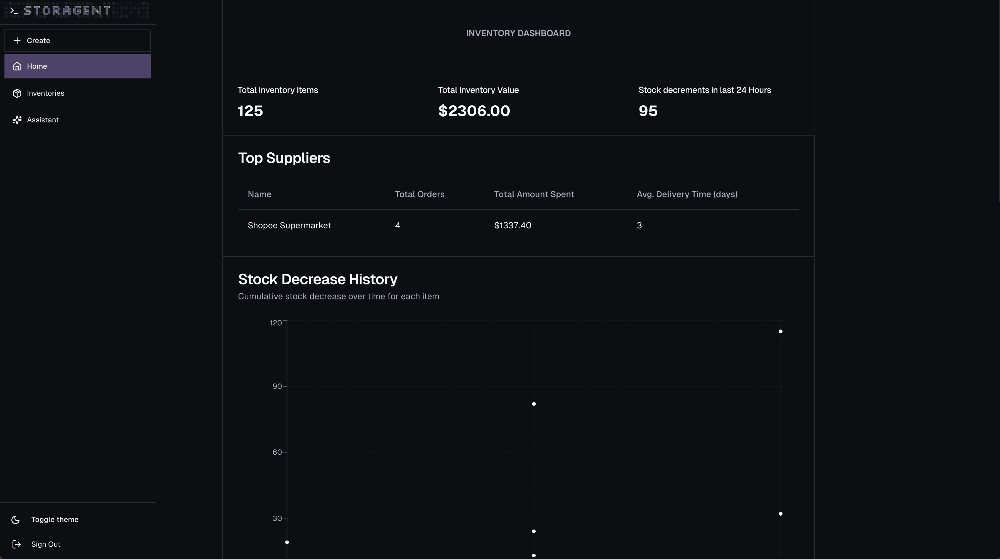

# Storagent: AI-Powered Inventory Manager

**Storagent** is an AI Inventory Manager designed to revolutionize inventory management by integrating on-chain technologies and autonomous decision-making. This intelligent web application helps you manage your warehouse inventory efficiently, update stock levels, and restock items using smart contracts. With features such as trend analysis, supplier selection, and fiat offramping, Storagent provides a seamless inventory management experience.



## **Features**

- **AI-Driven Inventory Management**

  - Automatically updates inventory levels when items are purchased.
  - Tracks usage trends and ensures inventory remains above predefined thresholds.
  - Identifies the fastest supplier and requests confirmation before purchasing restocks autonomously.

- **Comprehensive Dashboard**

  - Tracks inventory data such as usage patterns and supplier information.
  - Allows users to search for suppliers and manage inventory efficiently.

- **Smart Contract Integration**

  - Add new products or update inventory levels manually.
  - Enables secure and transparent inventory operations.

- **Seamless Consumer Experience**
  - Consumers can purchase items directly from the warehouse.
  - Users can offramp crypto payments from web3 transactions into fiat seamlessly.

---

## **Tech Stack**

- **Coinbase Developer Platform (CDP):**

  - **CDP Agent Kit**: AI-powered inventory management.
  - **CDP Onchain Kit**: Provides access to wallets and smart contract interactions.
  - **CDP Commerce**: Enables consumers to purchase items from the warehouse.
  - **CDP Offramp**: Allows users to convert crypto payments into fiat.

- **The Graph**:

  - Supports subgraphs for aggregated queries, event tracking, and pagination.

- **Nillion**:

  - Used for securely storing private data. Nillion is a secure computation network that decentralizes trust for high-value and sensitive data.

- **Playwright**:

  - Automates item purchases from suppliers.

- **Next.js**:

  - Provides a robust and dynamic frontend framework.

- **Blockchain Network**:
  - Built on **Base Sepolia**

---

## **How It Works**

1. **Inventory Monitoring**:  
   The AI agent tracks inventory levels and usage patterns in real-time, automatically detecting when restocking is needed.

2. **Supplier Selection**:  
   Using aggregated supplier data, the AI selects the supplier with the shortest lead time and initiates restocking.

3. **Manual Management**:  
   Users can manually interact with the smart contract to update stock levels, add new items, and monitor inventory data via the dashboard.

4. **Secure Transactions**:  
   Consumers purchase items using CDP Commerce, while CDP Offramp handles fiat conversions for smooth financial transactions.

5. **Autonomous Supplier Interaction**:  
   Playwright scripts automate purchases from suppliers based on AI-driven decisions.

---

## **Repository Structure**

repository-root
├── frontend # Frontend application (Next.js)
├── agentkit # AI logic and chatbot functionality (CDP Agent Kit)
├── contract # Smart contracts for inventory management
├── (to be added) playwright-scripts # Automation scripts for supplier interactions

---

## **How to Run**

1. **Clone the Repository**

   ```bash
   git clone https://github.com/eugenetayyj/ethagentic

   ```

2.	Configure Environment Variables


3. Install Dependencies

   ```bash
    npm i
   ```

4. Build the Application
   ```bash
   npm run build:frontend
   ```

5. Start the Application
   ```bash
   npm run start
   ```

6. Access the Dashboard
    Open http://localhost:3000 in your browser to interact with the application.


## Future Enhancements
- Add Playwright scripts for supplier interaction.
- Expand consumer purchase flow for enhanced user experience.
- Explore additional Nillion use cases for advanced privacy solutions.
